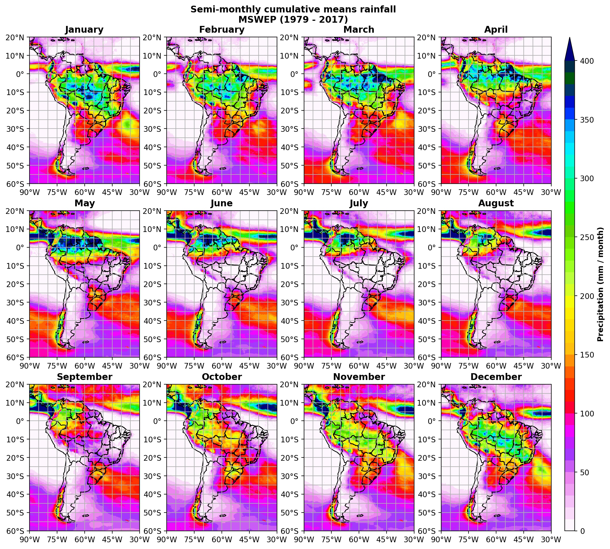
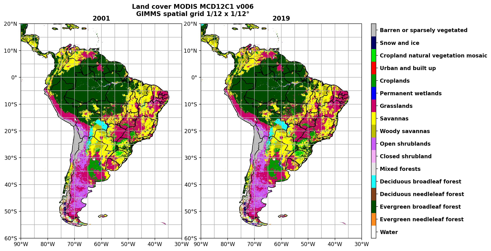

.. cdlearn documentation master file, created by
   sphinx-quickstart on Sun Oct 27 22:30:05 2019.
   You can adapt this file completely to your liking, but it should at least
   contain the root `toctree` directive.

Climate Data Learn (cdlearn)
============================

Welcome to cdlearn's documentation. This is a simple python package that I 
am currently developing as part of my PhD thesis in atmospheric physics. 
The main goal of my research is to better understand biosphere-atmosphere 
interactions in South America. For doing this, I have been applying some 
statistical learning methods to model these interactions. In this package 
you will find some tools for plotting climate data on South America maps.
We also provide statistical functions to analyze climate variables, 
which are known to have spatial and temporal autocorrelation properties. 
In addition, the multiplicity of hypothesis tests can be problem in 
data-driven studies of the atmosphere. These characteristic properties 
of climate data are taken into account in our library. The cdlearn's main 
dependence is the awesome `xarray package <http://xarray.pydata.org/en/stable/>`_, 
which makes much easier to deal with large environmental data sets in python 
language.

.. toctree::
   :maxdepth: 2
   :caption: Contents:

Images produced by cdlearn
==========================

Precipitation on South America
------------------------------

Land cover on South America
-----------------------------------

Contact the author
==================

Hello! My name is Alex Araujo. Please feel free to contact me for suggestions 
and questions, which are always welcome. You can find me at any one of the 
links below.

* Email: alex.fate2000@gmail.com

* `Linkedin <https://www.linkedin.com/in/alex-sandro-alves-de-araujo-11aa17153/>`_

* `Github <https://github.com/SandroAlex>`_